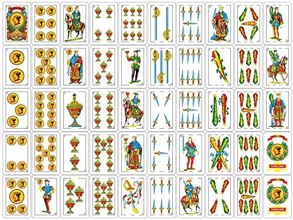

# MONOLITO · Truco Argentino

A fully playable **Argentine Truco** card game in the browser — face the
bluffing AI **El Monolito**, or play a friend **online 1v1** with a share link.
Futuristic midnight-blue table, flowing gold waves, 3D card interactions, and a
hand-drawn SVG Spanish deck. Works on desktop, phones, and tablets.

**▶ Play it: https://spencersearle.github.io/monolito-truco/**



## The game

- **2-player Truco** (vs AI, or vs a friend online), first to **30 points**, sin flor
- Full **envido** system: Envido, Envido-Envido, Real Envido, Falta Envido with
  malas/buenas math, mano-wins-ties, "el envido está primero"
- Full **truco** escalation: Truco → Retruco → Vale Cuatro, with the
  quiero-side-raises rule
- **Ir al mazo** (folding), all five **parda** (tied-trick) resolution cases
- Rules verified against 5 independent sources — see [RULES.md](RULES.md)
- 62-test rule suite: `node test_engine.js`

## Play online

Hit **PLAY ONLINE** on the title screen — the game opens a private table and
hands you a link. Send it to a friend; the moment they open it, the cards fly.

- Peer-to-peer over WebRTC ([PeerJS](https://peerjs.com), vendored), so the
  whole site still ships as static files on GitHub Pages — no game server
- Both browsers run the full rules engine in lockstep: the host deals and
  broadcasts the hands, every action is replicated to the other side
- Fuzz-tested for sync: `node test_multiplayer_sim.js` plays 200 full games
  (~3,000 hands) across two mirrored engines and asserts they never diverge

## The cards

All 40 cards of the baraja española are drawn programmatically in SVG
(`cards.js`), keeping authentic Castilian-pattern details — the **pinta**
border-breaks that identify each suit (oros 0, copas 1, espadas 2, bastos 3)
and traditional pip arrangements — restyled in navy and gold.

## Run locally

No build step, no dependencies:

```sh
python3 -m http.server 8000
# open http://localhost:8000
```

## Files

| File | What it is |
|---|---|
| `index.html` | Page shell |
| `styles.css` | Midnight-holotable theme: blue gradients, gold waves, 3D table |
| `cards.js` | SVG renderer for the 40-card Spanish deck |
| `engine.js` | Pure rules engine (no DOM — also runs in Node) |
| `ai.js` | El Monolito: heuristic opponent with bluffing |
| `net.js` | PeerJS transport for online 1v1 |
| `peerjs.min.js` | Vendored PeerJS 1.5.5 |
| `ui.js` | Animation queue, event presentation, game flow, online lobby |
| `test_engine.js` | Rule verification suite |
| `test_multiplayer_sim.js` | Lockstep-replication fuzz test for online play |
| `RULES.md` | The verified rules spec with sources |
| `truco_game.py` | The original tkinter prototype this project grew from |

Built for the CS 111 free coding project.
